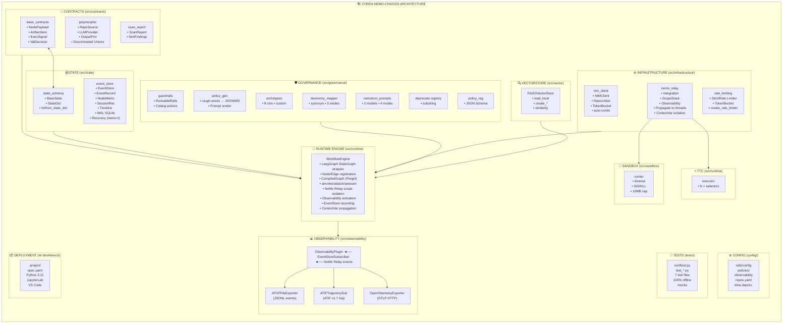

<h1 align="center">Zyren-NeMo-Chassis</h1>

**Modular, domain-agnostic infrastructure chassis for multi-agent state-machine systems powered by the NVIDIA NeMo/NIM ecosystem.**

[](https://www.python.org/downloads/release/python-3110/)
[](https://opensource.org/licenses/MIT)
[](https://github.com/astral-sh/ruff)
[](https://mypy-lang.org/)
[](https://bandit.readthedocs.io/)
[](https://pytest.org/)
[](https://www.nvidia.com/en-us/ai-workbench/)

---

## Executive Overview

**Zyren-NeMo-Chassis** is an independent, reusable, **domain-agnostic agent execution chassis** designed for building multi-agent state-machine systems that integrate seamlessly with the NVIDIA NeMo/NIM ecosystem. It provides a production-grade foundation for orchestrating complex AI workflows without imposing any business logic, domain assumptions, or application-specific constraints.

### What It Is

- **Infrastructure-only**: Pure plumbing — contracts, state management, event sourcing, rate limiting, governance, and runtime orchestration
- **Domain-agnostic**: Zero business logic; works for code generation, RAG, data analysis, robotics, or any multi-step AI workflow
- **NVIDIA-native**: First-class integration with NIM APIs, NeMo Guardrails, NeMo Relay observability, and Nemotron content safety
- **Hardware-constrained / Budget-friendly**: Designed for entry-level and budget environments (e.g., 16GB RAM, GTX 1650 class) using cloud NIMs (no local model serving)
- **Offline-testable**: 100% mockable external dependencies for CI/CD pipelines

### What It Is Not

- An application framework (no CLI, no UI, no pre-built agents)
- A model serving platform (relies on cloud NIM endpoints)
- A vector database (uses local FAISS for lightweight retrieval)
- A replacement for LangGraph/LangChain (wraps and extends them)

---

## Core Architectural Principles

| Principle | Implementation | Benefit |
|-----------|---------------|---------|
| **Domain-Agnostic** | No business logic in chassis; all domain code lives in user-defined nodes | Reusable across any vertical |
| **Type-Safe Pydantic v2** | `frozen=True` contracts, discriminated unions, `TypedDict` serialization | Compile-time guarantees, content-addressing |
| **Async-Native** | `asyncio` throughout; `async`/`await` in all public APIs | High concurrency, no blocking |
| **SQLite WAL Event-Sourced** | Append-only `aiosqlite` with WAL mode; full replay & session recovery | Durability, auditability, debuggability |
| **NeMo Guardrails Governed** | `RunnableRails` wrapper with Nemotron policy generation | Deterministic safety, policy-as-code |
| **Switchyard Dynamic Routing** | `NodePayload` envelope with `correlation_id`, `iteration`, `metadata` | Flexible topologies, request-response chains |
| **Resilient Rate-Limiting** | Dual-mode: TokenBucket (burst) + StrictRateLimiter (no-burst) | Cloud NIM compliance, 429 prevention |
| **Zero-Heavy-Server Footprint** | <50MB RAM, no Redis/Milvus/PostgreSQL, pure Python + SQLite | Runs on laptop, edge, CI containers |

---

## Complete Architecture Diagram

### Mermaid Flowchart

```mermaid
flowchart TB
    subgraph Contracts["📜 Contracts Layer (src/contracts)"]
        BC[base_contracts.py<br/>NodePayload, ArtifactItem,<br/>ExecutionSignal, ValidationDecision]
        PM[polymorphic.py<br/>RepoSourceInput, LLMProviderInput,<br/>OutputFormatInput]
        SR[scan_report.py<br/>ScanReport, NimFindings,<br/>SourceType]
    end

    subgraph State["🗄️ State & EventStore (src/state)"]
        SS[state_schema.py<br/>BaseState, StateDict,<br/>to/from_state_dict]
        ES[event_store.py<br/>EventStore, EventRecord,<br/>NodeMetricRecord, SessionRecord]
    end

    subgraph Infra["⚙️ Infrastructure & NIM Gateway (src/infrastructure)"]
        NC[nim_client.py<br/>NIMClient, RateLimiter,<br/>TokenBucket, auto-continuation]
        RL[rate_limiting.py<br/>StrictRateLimiter,<br/>RateLimitMode, create_rate_limiter]
        NR[nemo_relay_integration.py<br/>NeMoRelayIntegration,<br/>ScopeStack, Observability]
        GO[git_ops.py<br/>GitOps, CloneResult,<br/>parallel cloning]
    end

    subgraph Routing["🔀 Model Routing (src/contracts/polymorphic)"]
        NIM[NIMModelInput]
        OAI[OpenAIModelInput]
        LOC[LocalModelInput]
        LLM[LLMProviderInput<br/>Discriminated Union]
    end

    subgraph Vector["🔍 VectorStore & Retrieval (src/vectorstore)"]
        FS[faiss_store.py<br/>FAISSVectorStore,<br/>create_from_documents/texts]
    end

    subgraph Governance["🛡️ Governance & Guardrails (src/governance)"]
        GR[guardrails.py<br/>GuardrailsEngine,<br/>RunnableRails, Colang actions]
        PG[policy_generator.py<br/>PolicyGenerator,<br/>rough_words → JSON/MD/Prompt]
        AR[archetypes.py<br/>DeploymentContext,<br/>ArchetypeLoader]
        TM[taxonomy_mapper.py<br/>TaxonomyMapper,<br/>MappingMode]
        NP[nemotron_prompts.py<br/>NemotronPrompts,<br/>TargetModel, PromptMode]
        DR[deprecation_registry.py<br/>DeprecationRegistry,<br/>substring matching]
        PR[policy_registry.py<br/>PolicyRegistry,<br/>JSON Schema validation]
    end

    subgraph Sandbox["🏃 Sandbox Runner (src/sandbox)"]
        SR2[runner.py<br/>SandboxRunner,<br/>ExecutionResult, SIGKILL reaping]
    end

    subgraph Runtime["🚀 Runtime Engine & TTC (src/runtime)"]
        EN[engine.py<br/>WorkflowEngine,<br/>CompiledGraph, LangGraph]
        TTC[ttc.py<br/>TTCExecutor,<br/>TTCConfig, selectors]
    end

    subgraph Observability["📊 Observability (src/observability)"]
        OC[config.py<br/>ObservabilityConfig,<br/>ATOF/ATIF/OTel]
        OP[plugin.py<br/>ObservabilityPlugin,<br/>lifecycle management]
        SUB[subscribers.py<br/>EventStoreSubscriber,<br/>ATIFTrajectorySubscriber]
        EB[event_bridge.py<br/>EventStoreBridge,<br/>RelayEvent]
        EX[exporters.py<br/>ATOFFileExporter,<br/>ATIFExporter, OTelExporter]
    end

    subgraph Config["⚙️ Configuration (config/)"]
        RC[rails/config.yml<br/>Guardrails flows,<br/>resource limits]
        VT[v2_taxonomy.yaml<br/>22 Nemotron V2 categories,<br/>synonyms, aegis_labels]
        ARC[archetypes.yaml<br/>8 DeploymentContexts,<br/>custom categories]
        ER[enterprise_rag.json<br/>Generated policy example]
        PS[policy_json_schema.json<br/>JSON Schema validation]
        PT[policy_md_template.md<br/>Markdown rendering]
        NT[nemotron_system_prompt_template.txt<br/>6 Patterns A-F]
        OB[observability.toml<br/>ATOF/ATIF/OTel config]
        RR[repos.yaml<br/>180+ NVIDIA blueprint repos]
        ND[nims.deprecated.yaml<br/>31 deprecated NIMs]
    end

    %% Connections
    BC --> SS
    BC --> ES
    BC --> GR
    BC --> EN
    PM --> NC
    PM --> NR
    SS --> ES
    ES --> EN
    ES --> OP
    ES --> SUB
    NC --> RL
    NC --> NR
    NR --> OP
    NR --> EN
    GR --> PG
    GR --> AR
    GR --> TM
    GR --> NP
    GR --> DR
    GR --> PR
    GR --> RC
    PG --> VT
    PG --> ARC
    PG --> PS
    PG --> PT
    PG --> NT
    EN --> TTC
    EN --> SS
    EN --> ES
    EN --> NR
    GO --> SR2
    SR2 --> EN
    FS --> EN
    VT --> TM
    ARC --> AR
    PS --> PR
    PT --> PG
    NT --> NP
    OB --> OC
    RR --> GO
    ND --> DR
```



### Detailed Component Architecture Map



---

## Installation & Quick Start

### Prerequisites

- **Python 3.11+** (strictly required for `contextvars.Context` parameter support)
- **NVIDIA API Key** from [build.nvidia.com](https://build.nvidia.com/)
- **Git** (for repository cloning operations)
- **NVIDIA AI Workbench** (optional, for containerized development)

### Local Installation

```bash
# Clone the repository
git clone https://github.com/your-org/zyren-nemo-chassis.git
cd zyren-nemo-chassis

# Create virtual environment
python3.11 -m venv .venv
source .venv/bin/activate

# Install core dependencies
pip install -r requirements.txt

# Install development dependencies (optional)
pip install -e ".[dev]"

# Install observability dependencies (optional)
pip install -e ".[observability]"

# Configure environment
cp .env.example .env
# Edit .env with your NVIDIA_API_KEY
```

### NVIDIA AI Workbench Container Integration

The project includes a complete AI Workbench specification (`.project/spec.yaml`):

```bash
# Open in AI Workbench
nvwb open /path/to/zyren-nemo-chassis

# Or build manually
docker build -t zyren-nemo-chassis -f .project/Dockerfile .
docker run -it --rm -v $(pwd):/project zyren-nemo-chassis
```

The container provides:
- Python 3.11 base image (`nvcr.io/nvidia/ai-workbench/python-basic:1.0.9`)
- JupyterLab on port 8888 (auto-launch)
- VS Code Server integration
- Git LFS for model/data storage
- Persistent volumes for `.vscode-server` and project data

### Cloud NIM API Key Configuration

```bash
# .env file
NVIDIA_API_KEY=nvapi-xxxxxxxxxxxxxxxxxxxxxxxx
NVIDIA_BASE_URL=https://integrate.api.nvidia.com/v1  # Optional
NVIDIA_MODEL=nvidia/nemotron-3-ultra-550b-a55b      # Optional default
```

**Rate Limit Compliance**: Cloud NIMs enforce strict RPM limits. The chassis includes dual-mode rate limiting:
- **TokenBucket** (default): Allows bursts up to `max_rpm` capacity
- **StrictRateLimiter**: Enforces exact spacing (1 request per 60/max_rpm seconds) — **required for production cloud NIM usage**

```python
from src.infrastructure.nim_client import NIMClient, RateLimitMode

# Strict mode for cloud NIM compliance (no bursts)
client = NIMClient(
    model="nvidia/nemotron-3-ultra",
    api_key="your-key",
    rate_limit_mode=RateLimitMode.STRICT,  # Critical for cloud NIMs
    max_rpm=40,  # Adjust to your tier
)
```

---

## Subsystem Deep Dive (With Code Snippets)

### 1. Contracts Layer (`src/contracts`)

**Purpose**: Type-safe inter-node communication contracts. All nodes communicate exclusively through `NodePayload` envelopes. Immutable (`frozen=True`) for content-addressing guarantees.

#### Key Classes

```python
from src.contracts import (
    NodePayload, ArtifactItem, ExecutionSignal, ValidationDecision,
    SignalType, Justification,
    RepoSourceInput, LLMProviderInput, OutputFormatInput,
    ScanReport, NimFindings, SourceType,
)

# Generic message envelope for inter-node communication
payload = NodePayload(
    source_node="planner",
    target_node="executor",
    data={"task": "generate_code", "language": "python"},
    metadata={"priority": "high", "timeout": 300},
    correlation_id="req-123",  # Tracks request-response chains
    iteration=0,
)

# Route to different target (creates new immutable payload)
routed = payload.with_updated_target("validator")

# Increment iteration for retry loops
retried = payload.with_incremented_iteration()

# Content-addressed artifact with SHA256
artifact = ArtifactItem.create(
    artifact_type="code",
    content=b"def hello():\n    print('world')",
    created_by_node="generator",
    mime_type="text/x-python",
    metadata={"language": "python", "lines": 2},
)
print(f"Checksum: {artifact.checksum}")  # SHA256 hex digest
print(f"Size: {artifact.size_bytes} bytes")

# Execution control signals
signal = ExecutionSignal(
    signal_type=SignalType.CONTINUE,  # CONTINUE, HALT, RETRY, BRANCH
    reason="Validation passed",
    originating_node="validator",
    target_node="executor",
)

# Validation decision with merge semantics
decision = ValidationDecision(
    valid=True,
    errors=[],
    warnings=["Token budget at 80%"],
    suggested_action=SignalType.CONTINUE,
    validator_name="resource_validator",
)
merged = decision.merge(other_decision)  # Combines errors, takes worst action
```

#### Polymorphic Input Models (Discriminated Unions)

```python
from src.contracts import (
    RepoSourceInput, GitHubRepoInput, GitLabRepoInput, LocalPathInput, HttpUrlInput,
    LLMProviderInput, NIMModelInput, OpenAIModelInput, LocalModelInput,
    OutputFormatInput, JsonOutputInput, MarkdownOutputInput, TextOutputInput,
)

# Repository source - type-safe alternative to Optional fields
repo: RepoSourceInput = GitHubRepoInput(
    url="https://github.com/NVIDIA/NeMo",
    branch="main",
    token="ghp_xxx",  # Optional, for private repos
)

# LLM provider selection
llm: LLMProviderInput = NIMModelInput(
    model="nvidia/nemotron-3-ultra",
    api_key="nvapi-xxx",
    max_rpm=40,
    rate_limit_mode="strict",  # or "token_bucket"
)

# Output format specification
output: OutputFormatInput = JsonOutputInput(
    json_schema={"type": "object", "properties": {"result": {"type": "string"}}}
)
```

#### Scan Report Contracts

```python
from src.contracts import ScanReport, SourceType, LocalNimMatch, HostedNimMatch

report = ScanReport(
    source_type=SourceType.LOCAL,
    repository="my-project",
    branch="main",
    commit="abc123",
    findings=NimFindings(
        local_matches=[
            LocalNimMatch(
                file="src/agent.py",
                line=42,
                column=10,
                nim_name="nvidia/nemotron-3-ultra",
                context="client = ChatNVIDIA(model='nvidia/nemotron-3-ultra')",
                match_type="model",
                confidence=0.95,
            )
        ]
    ),
    summary=Summary(
        repositories_scanned=1,
        files_scanned=150,
        total_local_matches=1,
        unique_nims_found=1,
    ),
)

# Merge multiple scan reports
combined = report1.merge(report2)
```

---

### 2. State & EventStore (`src/state`)

**Purpose**: Generic execution state (`BaseState`) with append-only SQLite event sourcing (`EventStore`). Includes durable session recovery patterns from `nemo-rl-session-memory`.

#### BaseState — Generic Execution State

```python
from src.state import BaseState, to_state_dict, from_state_dict
from src.contracts import ArtifactItem, NodePayload, ExecutionSignal, SignalType, ValidationDecision

state = BaseState(
    execution_id="exec-abc123",
    max_iterations=100,
    max_tokens_per_execution=100_000,
)

# Node tracking
state = state.set_current_node("planner")
state = state.set_current_node("executor")  # previous_node = "planner"

# Artifact registry with reverse index
artifact = ArtifactItem.create(artifact_type="code", content=b"print(1)", created_by_node="gen")
state = state.add_artifact(artifact)
code_artifacts = state.get_artifacts_by_type("code")  # List[ArtifactItem]

# Payload queue with deduplication
payload = NodePayload(source_node="a", target_node="b", data={"x": 1})
state = state.enqueue_payload(payload)
state = state.enqueue_payload(payload)  # Duplicate ignored (same payload_id)
dequeued, state = state.dequeue_payload()

# Signals & validation
state = state.emit_signal(ExecutionSignal(signal_type=SignalType.HALT, reason="Done", originating_node="n"))
state = state.record_validation(ValidationDecision(valid=False, suggested_action=SignalType.HALT, validator_name="v"))

# Metrics
state = state.update_node_metrics("executor", duration_ms=150.5, tokens=200, api_calls=1)
print(state.total_tokens_consumed)  # 200
print(state.node_execution_times)   # {"executor": 150.5}

# Terminal conditions
if state.check_iteration_limit(): ...
if state.check_token_budget(): ...
if state.is_terminal(): ...  # Iteration limit OR token budget OR HALT signal OR validation HALT

# Serialization for persistence/checkpointing
state_dict = to_state_dict(state)
restored = from_state_dict(state_dict)
```

#### EventStore — Append-Only SQLite Event Sourcing

```python
from src.state import EventStore, EventRecord, NodeMetricRecord, SessionRecord, get_event_store

# Get default store (auto-initializes schema with WAL mode)
store = await get_event_store("data/events.db")

# Record events
event = await store.record_event(
    execution_id="exec-123",
    event_type="node_start",
    payload={"node": "executor", "input_size": 1024},
    node_name="executor",
    iteration=1,
    trace_id="trace-abc",      # OTel correlation
    span_id="span-xyz",
    relay_uuid="relay-123",    # NeMo Relay correlation
    relay_parent_uuid="relay-000",
)

# Record node metrics
metric = await store.record_node_metric(
    execution_id="exec-123",
    node_name="executor",
    start_time=datetime.utcnow(),
    end_time=datetime.utcnow(),
    duration_ms=150.5,
    exit_code=0,
    tokens_consumed=200,
    api_calls=1,
    success=True,
)

# Query events
events = await store.get_events("exec-123", limit=100)
node_events = await store.get_events_by_node("exec-123", "executor")
metrics = await store.get_node_metrics("exec-123")

# Durable session recovery (nemo-rl-session-memory pattern)
session = await store.create_session(
    session_id="sess-123",
    goal="Build RAG pipeline",
    current_subtask="Index documents",
    loaded_skills=["faiss_indexing", "nvidia_rerank"],
    status="in_progress",
    plan=["Clone repos", "Build index", "Test retrieval"],
    assumptions=["Documents in English", "GPU available"],
    blockers=[],
    handoff_summary="",
    next_actions=["Run indexer"],
    watch_outs=["Large PDFs may OOM"],
)

# Export session as Markdown (for handoffs)
markdown = session.to_markdown()
await store.export_session_bundle("sess-123", Path("output/session_bundle"))
# Creates: session_state.md, timeline.md, handoff.md, files.md
```

---

### 3. Infrastructure & NIM Gateway (`src/infrastructure`)

#### NIMClient — Centralized NVIDIA NIM Wrapper

```python
from src.infrastructure import NIMClient, get_nim_client, RateLimitMode
from langchain_core.messages import HumanMessage, SystemMessage

# Simple usage with global default
client = get_nim_client(
    model="nvidia/nemotron-3-ultra",
    api_key="nvapi-xxx",
    rate_limit_mode=RateLimitMode.STRICT,  # No-burst for cloud NIMs
    max_rpm=40,
    max_concurrent=3,
    auto_continue_truncated=True,  # Auto-continue on length truncation
    max_retries=3,
    base_delay=1.0,
    max_delay=60.0,
    timeout=120.0,
)

# Invoke with messages
result = await client.ainvoke([
    SystemMessage(content="You are a helpful assistant."),
    HumanMessage(content="Explain quantum computing in 100 words."),
])
print(result.content)

# Simple string interface
text = await client.ainvoke_simple(
    prompt="What is 2+2?",
    system_prompt="Answer concisely.",
)

# Streaming
async for chunk in client.astream([HumanMessage(content="Tell me a story")]):
    print(chunk.message.content, end="", flush=True)

# Batch
results = await client.abatch([
    [HumanMessage(content="Q1")],
    [HumanMessage(content="Q2")],
])

# Statistics
stats = client.get_stats()
# {
#   "model": "nvidia/nemotron-3-ultra",
#   "rate_limit_mode": "strict",
#   "strict_rate_limiter": {"rate_per_second": 0.666...},
#   "request_count": 42,
#   "total_wait_time": 12.3,
# }
```

#### Rate Limiting — Dual Mode

```python
from src.infrastructure import TokenBucket, RateLimiter, StrictRateLimiter, RateLimitMode, create_rate_limiter

# TokenBucket: Burst-tolerant (default)
bucket = TokenBucket(capacity=40, refill_rate=40/60.0)  # 40 RPM
wait = await bucket.take(1)  # Returns 0.0 if token available, else seconds to wait

# Composite RateLimiter: Semaphore (concurrency) + TokenBucket (RPM)
limiter = RateLimiter(max_concurrent=3, max_rpm=40)
async with limiter.acquire():
    await client.ainvoke(messages)  # Respects both limits

# StrictRateLimiter: NO BURSTS — exact spacing for cloud NIM compliance
strict = StrictRateLimiter(rate_per_second=40/60.0)  # Exactly 1 request per 1.5s
await strict.acquire()  # Blocks until interval elapsed

# Factory
strict_limiter, bucket_limiter = create_rate_limiter(
    mode="strict",  # or "token_bucket"
    max_rpm=40,
    max_concurrent=3,
)
```

#### NeMo Relay Integration — Scope Management & Observability

```python
from src.infrastructure import (
    NeMoRelayIntegration, NeMoRelayConfig, get_nemo_relay_integration,
    ObservabilityConfig, ATOFConfig, ATIFConfig, OpenTelemetryConfig,
)

# Configuration with observability
config = NeMoRelayConfig(
    register_langgraph_callback=True,
    register_langchain_middleware=True,
    global_guardrails={"pii": pii_guardrail_fn},
    global_intercepts={"tool_sanitizer": sanitize_fn},
    observability=ObservabilityConfig(
        enabled=True,
        atof=ATOFConfig(enabled=True, output_directory="logs/observability"),
        atif=ATIFConfig(enabled=True, output_directory="logs/trajectories", agent_name="my-agent"),
        opentelemetry=OpenTelemetryConfig(enabled=False),  # Enable for production
    ),
)

integration = NeMoRelayIntegration(config)

# Workflow scope with automatic isolation
async with integration.workflow_scope("my_workflow", "agent") as handle:
    # All NeMo Relay events in this block are scoped to this workflow
    result = await do_work()

# Fork context for parallel execution with ancestry preservation
child_context = integration.fork_asyncio_context()
# Python 3.11+: asyncio.create_task(coro, context=child_context)

# Propagate scope to thread pool
stack = integration.propagate_scope_to_thread()
with ThreadPoolExecutor() as executor:
    def worker():
        integration.set_thread_scope_stack(stack)
        # Worker sees same scope stack (shared trace)
    executor.submit(worker)

# Activate observability for execution
plugin = await integration.activate_observability("exec-123")
# ... run workflow ...
await integration.deactivate_observability(plugin)
# ATOF events written to logs/observability/events.jsonl
# ATIF trajectory available via plugin.export_atif()
```

#### GitOps — Parallel Repository Cloning

```python
from src.infrastructure import GitOps, RepoRegistry, RepoConfig
from src.config import RepoRegistry

# Load registry from config/repos.yaml
registry = RepoRegistry.load(Path("config/repos.yaml"))

gitops = GitOps(
    github_token="ghp_xxx",  # Injected into HTTPS URLs for private repos
    max_concurrent=5,
    clone_timeout=300.0,
)

# Clone all enabled scannable repos
summary = await gitops.clone_from_registry(
    registry,
    base_dir=Path("data/repos"),
    include_github_only=True,
    include_deprecated=False,
)

print(f"Cloned {summary.successful}/{summary.total} repos in {summary.total_duration_ms:.0f}ms")
for result in summary.results:
    if result.is_success:
        print(f"  ✓ {result.repo_name} @ {result.commit_hash[:8]}")
    else:
        print(f"  ✗ {result.repo_name}: {result.error_message}")
```

---

### 4. VectorStore & Retrieval (`src/vectorstore`)

**Purpose**: Lightweight local FAISS vector store for code/documentation retrieval. No external server required — perfect for hardware-constrained environments.

```python
from src.vectorstore import FAISSVectorStore, FAISSVectorStoreConfig
from langchain_core.embeddings import Embeddings
from langchain_core.documents import Document

# Using NVIDIA embeddings via NIM
from langchain_nvidia_ai_endpoints import NVIDIAEmbeddings
embedder = NVIDIAEmbeddings(model="nvidia/nv-embedqa-e5-v5", api_key="nvapi-xxx")

# Load existing index
store = FAISSVectorStore(FAISSVectorStoreConfig(
    path="data/faiss_index",
    embedder=embedder,
))

# Create new index from documents
documents = [
    Document(page_content="def foo(): return 42", metadata={"file": "a.py", "type": "function"}),
    Document(page_content="class Bar: pass", metadata={"file": "b.py", "type": "class"}),
]
store = FAISSVectorStore.create_from_documents(documents, embedder, "data/faiss_index")

# Or from raw texts
store = FAISSVectorStore.create_from_texts(
    texts=["function foo returns 42", "class Bar is empty"],
    embedder=embedder,
    path="data/faiss_index",
    metadatas=[{"type": "function"}, {"type": "class"}],
)

# Retrieval
retriever = store.as_retriever(search_type="similarity", search_kwargs={"k": 4})
docs = await retriever.ainvoke("function that returns a number")

# Direct similarity search
results = store.similarity_search("async function", k=5)
results_with_scores = store.similarity_search_with_score("error handling", k=3)

# Incremental updates
store.add_texts(["new function baz()"], metadatas=[{"type": "function", "file": "c.py"}])
```

---

### 5. Governance & Guardrails (`src/governance`)

**Purpose**: Deterministic safety layer using NeMo Guardrails + Nemotron Content Safety policy generation from rough requirements.

#### GuardrailsEngine — RunnableRails Wrapper

```python
from src.governance import GuardrailsEngine, get_guardrails_engine, ValidationResult
from src.state import BaseState

engine = get_guardrails_engine(
    config_path="config/rails/config.yml",
    rails_path="config/rails",
    max_iterations=100,
    max_tokens_per_call=8192,
    max_total_tokens=100_000,
)

# Validate state (runs all Colang flows + Nemotron policy)
decision = engine.validate(state)

# Or use enhanced validation with active Nemotron policy
decision = engine.validate_with_policy(state)

# Convert to ValidationDecision for state recording
from src.contracts import ValidationDecision, SignalType
val_decision = engine.to_decision(ValidationResult(
    valid=decision.valid,
    errors=decision.errors,
    warnings=decision.warnings,
    suggested_action=decision.suggested_action,
    validator_name="guardrails",
    metadata=decision.metadata,
))
state = state.record_validation(val_decision)
```

#### PolicyGenerator — BYO Nemotron Policies from Rough Words

```python
from src.governance import (
    PolicyGenerator, PolicyGenerationRequest, PolicyGenerationResult,
    TargetModel, DeploymentContext, PromptMode,
)

generator = PolicyGenerator()

request = PolicyGenerationRequest(
    rough_words="block PII leaks, prevent code injection, allow internal docs, flag trade secrets",
    target_model=TargetModel.NCS_REASONING_4B,
    deployment_context=DeploymentContext.ENTERPRISE_RAG,
    custom_categories=[{
        "name": "internal_api_key",
        "display_name": "Internal API Key",
        "definition": "API keys for internal services",
        "severity": "S3",
        "in_scope": ["sk_live_*", "sk_test_*"],
        "out_of_scope": ["public API keys in documentation"],
        "examples_safe": ["sk_test_abc123 in example code"],
        "examples_unsafe": ["sk_live_xyz789 in production config"],
    }],
    severity_overrides={"pii_privacy": "S3"},
    allow_list=["Internal documentation references", "Code snippets from proprietary repos"],
    locale="en-US",
    jurisdiction="US",
    output_formats=["markdown", "json", "prompt"],
)

result: PolicyGenerationResult = generator.generate(request)

# Artifacts produced
print(result.markdown)      # Human-readable policy (Markdown)
print(result.json_taxonomy) # Machine-readable JSON (validated against schema)
print(result.system_prompt) # Ready-to-use Nemotron system prompt
print(result.assumptions)   # ["Starting archetype: Enterprise RAG...", "Taxonomy mode: v2_plus_custom..."]
print(result.taxonomy_mode) # MappingMode.V2_PLUS_CUSTOM
```

#### TaxonomyMapper — Rough Words → V2 Categories

```python
from src.governance import TaxonomyMapper, MappingMode, MappingResult

mapper = TaxonomyMapper()  # Loads config/policies/v2_taxonomy.yaml

result: MappingResult = mapper.map_rough_words(
    rough_words="pii, code injection, trade secrets, internal docs",
    archetype_categories=["pii_privacy", "malware", "trade_secret"],  # Optional filter
)

print(result.mode)              # MappingMode.CLEAN_V2 | V2_PLUS_CUSTOM | MOSTLY_CUSTOM
print(result.match_ratio)       # 0.0-1.0
print(result.matched_categories) # {"pii_privacy": ["pii"], "malware": ["code injection"]}
print(result.unmapped_words)    # ["trade secrets", "internal docs"]
print(result.warnings)          # ["2 rough words unmapped: trade secrets, internal docs"]
```

#### NemotronPrompts — Dual-Target System Prompt Rendering

```python
from src.governance import NemotronPrompts, TargetModel, PromptMode

prompts = NemotronPrompts()  # Loads config/policies/nemotron_system_prompt_template.txt

# For Nemotron-Content-Safety-Reasoning-4B (text, English)
system_prompt = prompts.render(
    target_model=TargetModel.NCS_REASONING_4B,
    policy=result.json_taxonomy,
    mode=PromptMode.NO_THINK,        # or THINK for reasoning trace
)

# For Nemotron-3-Content-Safety (multimodal, 12 languages)
system_prompt = prompts.render(
    target_model=TargetModel.NCS_VL,
    policy=result.json_taxonomy,
    mode=PromptMode.NO_THINK,
    categories_mode=PromptMode.CATEGORIES,  # or NO_CATEGORIES
)

# Output format (NCS-Reasoning-4B):
# "Prompt harm: harmful/unharmful\nResponse harm: harmful/unharmful"
# With /think: includes reasoning trace before verdict
```

#### DeprecationRegistry — Deprecated NIM Enforcement

```python
from src.governance import DeprecationRegistry, get_deprecation_registry

registry = get_deprecation_registry()  # Loads config/nims.deprecated.yaml

# Check if a NIM identifier is deprecated
matches = registry.check("nvidia/nemotron-3-ultra-550b-a55b")
# Returns list of matching deprecated patterns (case-insensitive substring)

if registry.is_deprecated("qwen/qwen3.5-122b-a10b"):
    print("WARNING: This NIM is deprecated!")

# Manage list (in-memory, call save() to persist)
registry.add_deprecated("old/model-v1")
registry.remove_deprecated("old/model-v1")
registry.save()
```

---

### 6. Sandbox Runner (`src/sandbox`)

**Purpose**: Deterministic subprocess execution with hard timeouts, output capture, and zombie reaping.

```python
from src.sandbox import SandboxRunner, ExecutionResult, get_sandbox_runner

runner = get_sandbox_runner(
    default_timeout=300.0,
    default_cwd="/project",
    max_output_size=10 * 1024 * 1024,  # 10MB cap
)

# Async execution
result = await runner.run(
    command=["python3", "-c", "print('hello'); import time; time.sleep(1)"],
    timeout=10.0,
    cwd="/project",
    env={"CUSTOM_VAR": "value"},
)

print(result.exit_code)      # 0
print(result.stdout)         # "hello\n"
print(result.stderr)         # ""
print(result.duration_ms)    # ~1000
print(result.success)        # True
print(result.timed_out)      # False

# Timeout handling (SIGKILL + reap)
result = await runner.run(["sleep", "10"], timeout=1.0)
print(result.timed_out)      # True
print(result.exit_code)      # 124 (SIGXCPU) or 137 (SIGKILL)
print(result.error_message)  # "Command timed out after 1000ms"

# Synchronous wrapper
result = runner.run_sync(["echo", "sync"])

# Batch with concurrency limit
results = await runner.run_batch(
    commands=[["sleep", "0.1"] for _ in range(10)],
    max_concurrent=3,
    timeout=5.0,
)

# Exit code parsing
parsed = SandboxRunner.parse_exit_code(137)
# {"success": False, "signal": "SIGKILL", "meaning": "Killed by SIGKILL (OOM kill or manual)"}
```

---

### 7. Runtime Engine & TTC (`src/runtime`)

#### WorkflowEngine — LangGraph Orchestrator with NeMo Relay Integration

```python
from src.runtime import WorkflowEngine, CompiledGraph, create_workflow_engine
from src.state import BaseState
from src.contracts import SignalType

engine = create_workflow_engine(max_iterations=50)

# Register nodes (async functions: BaseState -> BaseState)
async def planner(state: BaseState) -> BaseState:
    # Business logic here
    plan = {"steps": ["fetch", "process", "validate"]}
    return state.model_copy(update={"metadata": {"plan": plan}})

async def executor(state: BaseState) -> BaseState:
    # Simulate work
    await asyncio.sleep(0.1)
    return state.increment_iteration().update_node_metrics("executor", 100.0, tokens=50)

async def validator(state: BaseState) -> BaseState:
    if state.iteration >= 3:
        return state.emit_signal(ExecutionSignal(
            signal_type=SignalType.HALT, reason="Max iterations", originating_node="validator"
        ))
    return state.increment_iteration()

engine.register_node("planner", planner, description="Create execution plan", tags=["entry"])
engine.register_node("executor", executor, tags=["worker"])
engine.register_node("validator", validator, tags=["guard"])

# Edges
engine.register_edge("planner", "executor")
engine.register_edge("executor", "validator")

# Conditional edge
engine.register_conditional_edge(
    "validator",
    lambda s: "executor" if not s.is_terminal() else "END",
    description="Loop until terminal",
)

engine.set_entry_point("planner")

# Compile to LangGraph Pregel
compiled: CompiledGraph = engine.compile()

# Execute with full observability & NeMo Relay isolation
initial_state = BaseState(execution_id="exec-456", max_iterations=10)
final_state = await compiled.ainvoke(initial_state)

# Batch execution (20 concurrent workflows, each with isolated NeMo Relay scope)
states = [BaseState(execution_id=f"batch-{i}") for i in range(20)]
results = await compiled.abatch(states)

# Streaming
async for chunk in compiled.astream(initial_state):
    print(f"Node: {chunk.get('__node__')}, Iteration: {chunk.get('iteration')}")
```

#### TTCExecutor — Test-Time Compute Framework

```python
from src.runtime import TTCExecutor, TTCConfig, majority_vote_selector, best_of_n_selector, first_result_selector

# Configuration
config = TTCConfig(
    num_executions=5,
    max_concurrency=3,
    early_stop_threshold=3,  # Stop if 3 results agree
    selector=majority_vote_selector,  # or first_result_selector, or best_of_n_selector
)

# Wrap any async function
async def llm_call(prompt: str) -> str:
    return await nim_client.ainvoke_simple(prompt)

executor = TTCExecutor(config, llm_call)

# Execute with test-time compute
result = await executor.execute("What is the capital of France?")
# Runs llm_call 5x in parallel (max 3 concurrent), returns majority vote

# Best-of-N with custom scorer
config = TTCConfig(
    num_executions=10,
    max_concurrency=5,
    selector=lambda results: best_of_n_selector(results, scorer=len),  # Longest response
)
executor = TTCExecutor(config, llm_call)
result = await executor.execute("Write a detailed explanation of transformers.")
```

---

### 8. Observability (`src/observability`)

**Purpose**: NeMo Relay plugin integration providing ATOF (raw events), ATIF (trajectories), and OpenTelemetry (traces).

```python
from src.observability import (
    ObservabilityConfig, ATOFConfig, ATIFConfig, OpenTelemetryConfig,
    ObservabilityPlugin, EventStoreSubscriber, ATIFTrajectorySubscriber,
    ATOFFileExporter, ATIFExporter, OpenTelemetryExporter,
    build_atif_trajectory,
)
from src.state import EventStore, get_event_store

# Configuration (also loadable from TOML)
config = ObservabilityConfig(
    enabled=True,
    atof=ATOFConfig(enabled=True, output_directory="logs/observability", filename="events.jsonl"),
    atif=ATIFConfig(enabled=True, output_directory="logs/trajectories", agent_name="my-agent"),
    opentelemetry=OpenTelemetryConfig(enabled=True, endpoint="http://otel:4318/v1/traces"),
    sanitize_payloads=True,
    sensitive_fields=["api_key", "authorization", "password", "secret", "token"],
)

# Load from TOML (config/observability.toml)
import tomllib
with open("config/observability.toml", "rb") as f:
    toml_data = tomllib.load(f)
config = ObservabilityConfig.from_toml(toml_data)

# Plugin lifecycle (managed automatically by WorkflowEngine)
event_store = await get_event_store()
plugin = ObservabilityPlugin(config=config, event_store=event_store, execution_id="exec-789")
await plugin.activate()
# ... run workflow ...
await plugin.deactivate()  # Flushes all exporters

# Export ATIF trajectory
trajectory = plugin.export_atif()
# {
#   "schema_version": "ATIF-v1.7",
#   "agent": {"name": "my-agent", ...},
#   "steps": [
#     {"type": "user", "content": "Hello", "metadata": {...}},
#     {"type": "agent", "content": "Hi there!", "tool_calls": [], "metadata": {...}},
#     {"type": "system", "content": "tool result", "metadata": {"tool_name": "search"}},
#   ],
#   "subagent_trajectories": [],
# }

# Direct file export
atif_exporter = ATIFExporter(event_store, Path("logs/trajectories"))
filepath = atif_exporter.export_to_file("exec-789")
```

---

## Testing Strategy & Offline Quality Gates

### Test Suite Structure

```
tests/
├── conftest.py                      # Shared fixtures, mock NVIDIA client, NeMo Relay isolation
├── test_base_contracts.py           # Contracts: NodePayload, ArtifactItem, signals, decisions
├── test_state_schema.py             # BaseState: CRUD, metrics, terminal conditions, serialization
├── test_nim_client.py               # NIMClient: invoke, stream, batch, retry, rate limiting
├── test_nemo_relay_context_isolation.py  # Context isolation, fork, thread propagation
├── test_observability.py            # ATOF/ATIF/OTel exporters, plugin lifecycle, config
└── test_stress_concurrency.py       # Stress: 100-500 concurrent ops, token drift, full pipeline
```

### Mock Fixtures (`conftest.py`)

```python
# Mock NVIDIA client for 100% offline testing
class MockNVIDIAClient:
    def __init__(self, **kwargs):
        self.model = kwargs.get("model", "mock-model")
        self.call_count = 0
        self._response_text = "Mock response"
        self._should_fail = False

    def set_response(self, text: str): ...
    def set_failure(self, exception: Exception): ...

    async def ainvoke(self, messages, **kwargs) -> ChatResult: ...
    async def astream(self, messages, **kwargs) -> AsyncIterator[ChatGeneration]: ...
    async def abatch(self, messages_list, **kwargs) -> list[ChatResult]: ...
    async def ainvoke_simple(self, prompt, system_prompt=None, **kwargs) -> str: ...

@pytest.fixture
def mock_nvidia_client():
    return MockNVIDIAClient()

# NeMo Relay context isolation per test
@pytest.fixture
def isolated_nemo_relay_context():
    integration = get_nemo_relay_integration()
    integration.create_isolated_scope_stack()
    child_context = integration.fork_asyncio_context()
    contextvars.copy_context().run(child_context.run, lambda: None)
    yield integration
    integration.get_scope_stack()  # Reset
```

### Quality Gate Commands

```bash
# Run all tests (async, verbose, strict)
pytest -v --strict-markers --strict-config

# Run with coverage
pytest --cov=src --cov-report=term-missing --cov-report=html

# Linting (Ruff)
ruff check src tests
ruff format src tests  # Auto-fix

# Type checking (MyPy strict)
mypy src

# Security scan (Bandit)
bandit -r src

# All gates (CI pipeline)
ruff check src tests && mypy src && bandit -r src && pytest -v --strict-markers
```

### Test Coverage Highlights

| Test Module | Coverage Focus |
|-------------|----------------|
| `test_base_contracts.py` | Immutable payloads, artifact checksums, signal/decision merge, TypedDict roundtrips |
| `test_state_schema.py` | State transitions, artifact indexing, payload deduplication, terminal detection |
| `test_nim_client.py` | TokenBucket concurrency, RateLimiter semaphore, auto-continue, tenacity retry, 50-req burst |
| `test_nemo_relay_context_isolation.py` | 10 concurrent workflows = 10 unique scope stacks, fork ancestry, thread propagation |
| `test_observability.py` | ATOF JSONL writing, ATIF v1.7 trajectory building, OTel exporter, config TOML parsing |
| `test_stress_concurrency.py` | 200 concurrent TokenBucket takes, 50 req vs semaphore(3), 100 EventStore writes, 20 workflows |

---

## Performance, Concurrency & Hardware Limits

### Concurrency Model

| Component | Mechanism | Default Limits |
|-----------|-----------|----------------|
| **NIMClient** | `asyncio.Semaphore` + `TokenBucket` / `StrictRateLimiter` | 3 concurrent, 40 RPM |
| **WorkflowEngine** | LangGraph `Pregel` + `RunnableConfig(max_steps)` | 100 iterations max |
| **GitOps** | `asyncio.Semaphore` per `clone_repos_parallel` | 5 concurrent clones |
| **SandboxRunner** | `asyncio.wait_for` + process group `SIGKILL` | 300s timeout, 10MB output |
| **TTCExecutor** | `asyncio.Semaphore` + `asyncio.as_completed` | Configurable per executor |
| **EventStore** | `aiosqlite` WAL mode + connection pooling | Single writer, multiple readers |

### Rate-Limiting Mathematics

**TokenBucket (Burst-Tolerant)**:
```
capacity = max_rpm (e.g., 40)
refill_rate = max_rpm / 60.0 tokens/second (e.g., 0.667 tokens/sec)
wait_time = max(0, (tokens_needed - current_tokens) / refill_rate)
```
- Allows burst of `max_rpm` requests instantly
- Refills continuously at `max_rpm/60` per second
- **Risk**: Cloud NIMs may return 429 on burst

**StrictRateLimiter (No-Burst, Cloud-NIM-Safe)**:
```
rate_per_second = max_rpm / 60.0
AsyncLimiter(max_rate=1, time_period=1/rate_per_second)
```
- Exactly 1 request per `60/max_rpm` seconds (e.g., 1.5s for 40 RPM)
- Zero burst allowance — mathematically guarantees no 429s
- **Use in production** with cloud NIM endpoints

### Memory Footprint

| Component | Typical Memory | Notes |
|-----------|---------------|-------|
| **Base Process** | ~15-20 MB | Python 3.11 + core deps |
| **NIMClient** | ~5 MB | HTTP connection pool |
| **EventStore (SQLite)** | ~2-5 MB | WAL file + page cache |
| **FAISS Index** | ~10-50 MB | Depends on document count |
| **NeMo Relay (fallback)** | ~1 MB | ContextVar stacks only |
| **Total (typical)** | **< 50 MB** | Well within entry-level & budget hardware limits |

### Hardware Compliance (Budget & Entry-Level Environments, e.g., 16GB RAM / GTX 1650)

| Constraint | Solution |
|------------|----------|
| **No local LLM** | Cloud NIM APIs only (`langchain-nvidia-ai-endpoints`) |
| **No local embeddings** | NVIDIA NIM embeddings (`nvidia/nv-embedqa-e5-v5`) |
| **No Milvus/Redis/PostgreSQL** | SQLite WAL + local FAISS (pure Python) |
| **GPU memory** | Zero — all inference offloaded to cloud NIMs |
| **Disk I/O** | SQLite WAL + FAISS mmap — SSD recommended |

---

## Security, Governance & Immutability

### Input/Output Sanitization

```python
# NeMo Guardrails forbidden patterns (config/rails/config.yml)
forbidden_patterns:
  - "rm -rf"
  - "sudo "
  - "chmod 777"
  - "__import__"
  - "eval("
  - "exec("

# Observability payload sanitization (config/observability.toml)
sanitize_payloads = true
sensitive_fields = ["api_key", "authorization", "password", "secret", "token"]
```

### Pydantic v2 `frozen=True` Contracts

```python
# All contract models are immutable
class NodePayload(BaseModel):
    model_config = {"frozen": True}  # Prevents mutation
    # ...

payload = NodePayload(source_node="a", target_node="b")
# payload.source_node = "c"  # ❌ FrozenInstanceError
new_payload = payload.model_copy(update={"target_node": "c"})  # ✅ New instance
```

### SHA256 Content-Addressing

```python
# ArtifactItem automatically computes SHA256
artifact = ArtifactItem.create(
    artifact_type="code",
    content=b"print('hello')",
    created_by_node="generator",
)
# artifact.checksum == "2cf24dba5fb0a30e26e83b2ac5b9e29e1b161e5c1fa7425e73043362938b9824"
# Identical content → identical checksum → deduplication
```

### Subprocess Isolation & SIGKILL Reaping

```python
# SandboxRunner uses process groups for clean termination
async def run(self, command, timeout=300):
    process = await asyncio.create_subprocess_exec(
        *cmd_list,
        stdout=asyncio.subprocess.PIPE,
        stderr=asyncio.subprocess.PIPE,
        start_new_session=True,  # New process group
    )
    try:
        stdout, stderr = await asyncio.wait_for(process.communicate(), timeout)
    except asyncio.TimeoutError:
        # Kill entire process group (including children)
        os.killpg(os.getpgid(process.pid), signal.SIGKILL)
        await process.wait()  # Reap zombie
        return ExecutionResult(exit_code=137, timed_out=True, ...)
```

### Deprecation Registry Guards

```python
# Prevents usage of deprecated NIMs
registry = get_deprecation_registry()
if registry.is_deprecated(model_name):
    raise ValueError(f"Model {model_name} is deprecated: {registry.check(model_name)}")
```

---

## Repository File Tree

```
zyren-nemo-chassis/
├── .env                          # Local environment (gitignored)
├── .env.example                  # Template for NVIDIA_API_KEY
├── .gitattributes
├── .gitignore
├── .project/
│   └── spec.yaml                 # NVIDIA AI Workbench specification
├── .pytest_cache/
├── .ruff_cache/
├── .mypy_cache/
├── README.md                     # THIS FILE
├── pyproject.toml                # Package config, tool settings (ruff, mypy, bandit, pytest)
├── requirements.txt              # Pinned dependencies
├── variables.env                 # AI Workbench container env vars
├── onStart.bash                  # Container start hook
├── preBuild.bash                 # Pre-build hook
├── postBuild.bash                # Post-build hook
├── tests/
│   ├── test_config.py            # Config attribute access test
│   ├── test_singleton.py         # Singleton behavior test
│   ├── conftest.py
│   ├── test_base_contracts.py
│   ├── test_nemo_relay_context_isolation.py
│   ├── test_nim_client.py
│   ├── test_observability.py
│   ├── test_state_schema.py
│   └── test_stress_concurrency.py
├── config/
│   ├── rails/
│   │   └── config.yml            # NeMo Guardrails flows, limits, Nemotron policy ref
│   ├── policies/
│   │   ├── v2_taxonomy.yaml      # 22 Nemotron V2 categories with synonyms
│   │   ├── archetypes.yaml       # 8 DeploymentContext archetypes
│   │   ├── enterprise_rag.json   # Generated policy example (560+ lines)
│   │   ├── policy_json_schema.json  # JSON Schema for policy validation
│   │   ├── policy_md_template.md # Markdown template for policy rendering
│   │   └── nemotron_system_prompt_template.txt  # 6 prompt patterns (A-F)
│   ├── observability.toml        # ATOF/ATIF/OTel configuration
│   ├── repos.yaml                # 180+ NVIDIA blueprint repositories
│   └── nims.deprecated.yaml      # 31 deprecated NIM identifiers
├── data/                         # Runtime data (gitignored)
│   ├── events.db                 # SQLite event store
│   ├── faiss_index/              # FAISS vector indices
│   ├── repos/                    # Cloned repositories
│   └── scratch/                  # Temporary workspace
├── logs/                         # Observability output (gitignored)
│   ├── observability/
│   │   └── events.jsonl          # ATOF raw events
│   └── trajectories/
│       └── trajectory_*.json     # ATIF v1.7 trajectories
├── models/                       # Model artifacts (Git LFS)
├── src/
│   ├── __init__.py
│   ├── contracts/
│   │   ├── __init__.py           # Exports all contract types
│   │   ├── base_contracts.py     # NodePayload, ArtifactItem, ExecutionSignal, ValidationDecision
│   │   ├── polymorphic.py        # Discriminated unions: RepoSourceInput, LLMProviderInput, OutputFormatInput
│   │   └── scan_report.py        # ScanReport, NimFindings, SourceType
│   ├── state/
│   │   ├── __init__.py
│   │   ├── state_schema.py       # BaseState, StateDict, to/from_state_dict
│   │   └── event_store.py        # EventStore, EventRecord, NodeMetricRecord, SessionRecord, TimelineEntry
│   ├── infrastructure/
│   │   ├── __init__.py
│   │   ├── nim_client.py         # NIMClient, RateLimiter, TokenBucket, auto-continue
│   │   ├── rate_limiting.py      # StrictRateLimiter, RateLimitMode, create_rate_limiter
│   │   ├── nemo_relay_integration.py  # NeMoRelayIntegration, ScopeStack, ObservabilityConfig
│   │   └── git_ops.py            # GitOps, CloneResult, CloneSummary, parallel cloning
│   ├── vectorstore/
│   │   ├── __init__.py
│   │   └── faiss_store.py        # FAISSVectorStore, FAISSVectorStoreConfig
│   ├── config/
│   │   ├── __init__.py
│   │   └── repo_registry.py      # RepoRegistry, RepoConfig, BlueprintMeta, Defaults
│   ├── sandbox/
│   │   ├── __init__.py
│   │   └── runner.py             # SandboxRunner, ExecutionResult, SIGKILL reaping
│   ├── governance/
│   │   ├── __init__.py
│   │   ├── guardrails.py         # GuardrailsEngine, RunnableRails, Colang actions
│   │   ├── policy_generator.py   # PolicyGenerator, rough_words → JSON/MD/Prompt
│   │   ├── archetypes.py         # DeploymentContext, Archetype, ArchetypeLoader
│   │   ├── taxonomy_mapper.py    # TaxonomyMapper, MappingMode, MappingResult
│   │   ├── nemotron_prompts.py   # NemotronPrompts, TargetModel, PromptMode
│   │   ├── deprecation_registry.py  # DeprecationRegistry, substring matching
│   │   └── policy_registry.py    # PolicyRegistry, JSON Schema validation
│   ├── runtime/
│   │   ├── __init__.py
│   │   ├── engine.py             # WorkflowEngine, CompiledGraph, LangGraph wrapper
│   │   └── ttc.py                # TTCExecutor, TTCConfig, selectors (majority, best-of-N)
│   └── observability/
│       ├── __init__.py
│       ├── config.py             # ObservabilityConfig, ATOF/ATIF/OTel configs
│       ├── plugin.py             # ObservabilityPlugin lifecycle
│       ├── subscribers.py        # EventStoreSubscriber, ATIFTrajectorySubscriber
│       ├── event_bridge.py       # EventStoreBridge, RelayEvent translation
│       └── exporters.py          # ATOFFileExporter, ATIFExporter, OpenTelemetryExporter
└── tests/
    ├── conftest.py               # Mock NVIDIA client, NeMo Relay isolation fixtures
    ├── test_base_contracts.py
    ├── test_state_schema.py
    ├── test_nim_client.py
    ├── test_nemo_relay_context_isolation.py
    ├── test_observability.py
    └── test_stress_concurrency.py
```

---

## License

MIT License — see [LICENSE](LICENSE) for details.

---

## Acknowledgments

Built for the **NVIDIA NeMo/NIM ecosystem** with deep integration of:
- **NVIDIA NIM** — Cloud inference endpoints
- **NeMo Guardrails** — Deterministic runtime safety
- **NeMo Relay** — Managed execution scopes & observability (ATOF/ATIF/OTel)
- **Nemotron Content Safety** — Reasoning-4B & Nemotron-3 policy enforcement
- **LangGraph** — Stateful multi-agent orchestration
- **FAISS** — Local vector similarity search

---

*Zyren-NeMo-Chassis — The chassis. You bring the engine.* 🚀
